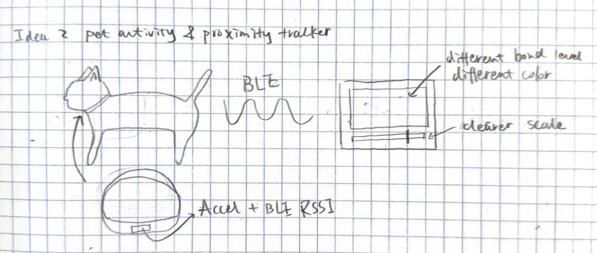
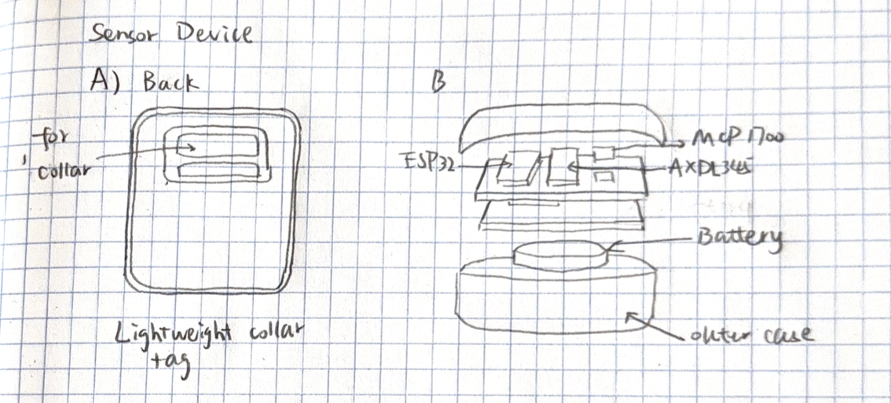
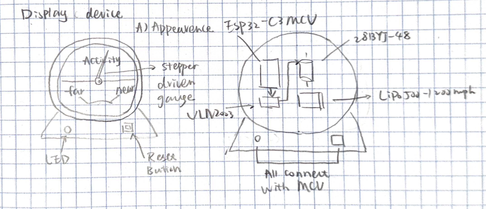
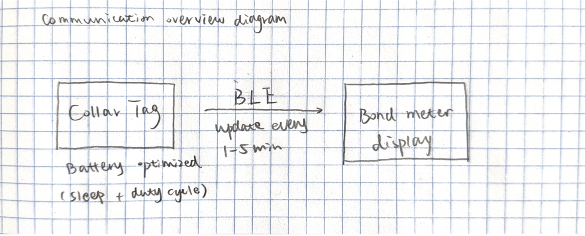
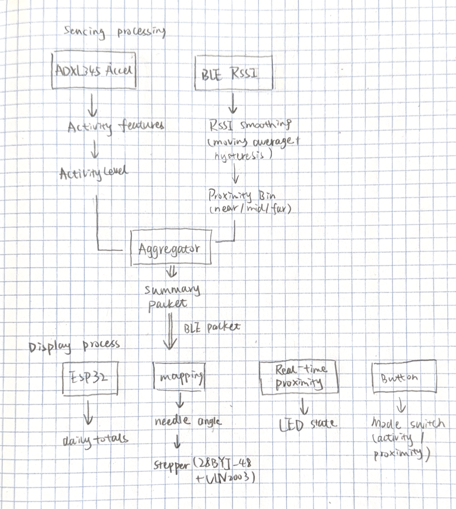
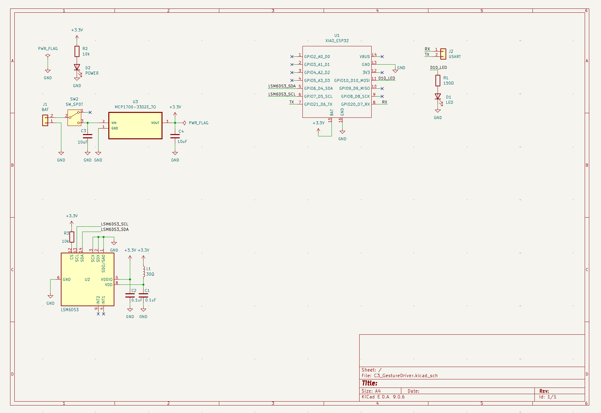
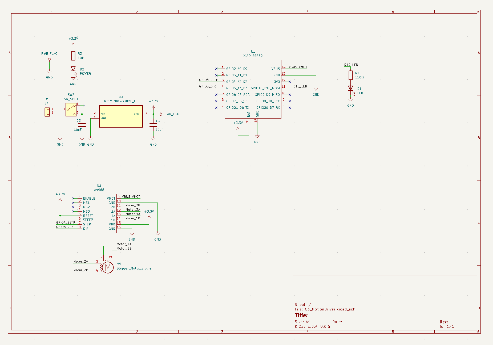
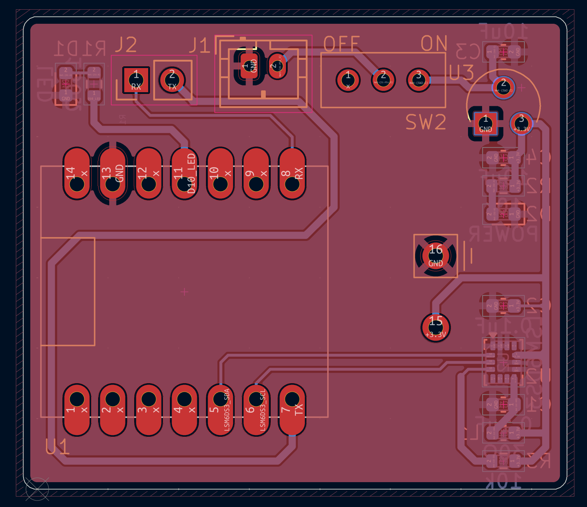
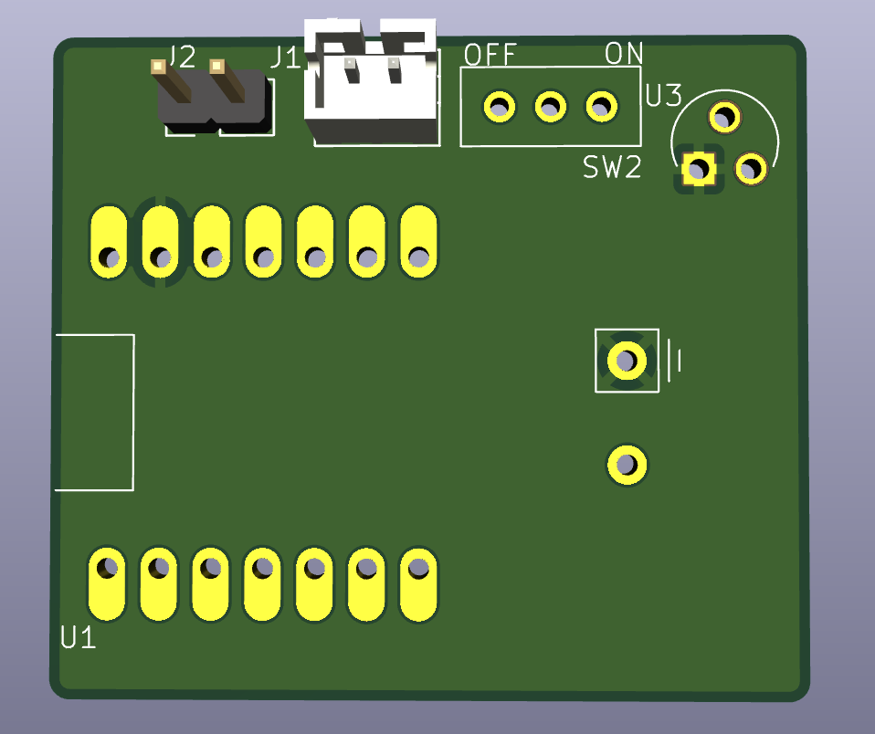
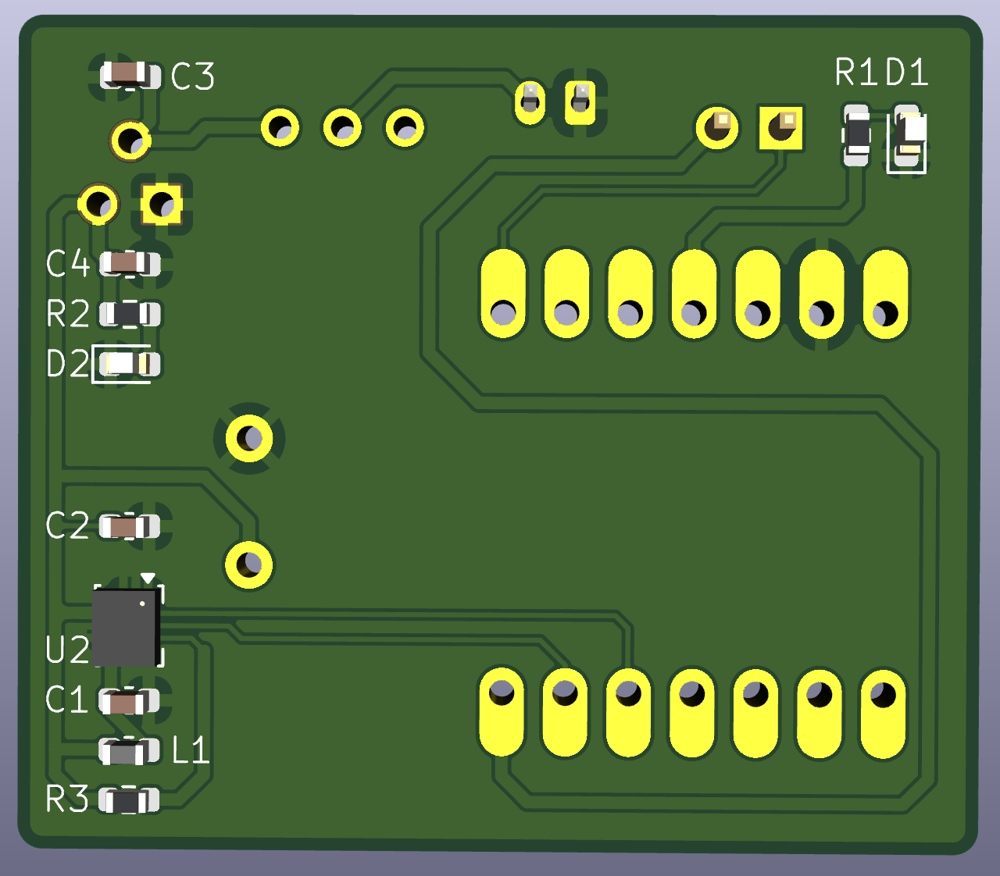

# Pet Activity & Proximity Tracker

A wearable sensing tag for pets and a tabletop display that visualizes daily activity and proximity-based companionship.  
The system is designed as a calm, ambient tool that supports reflection rather than real-time alerts, helping pet owners understand patterns of activity and togetherness over the course of a day. By translating sensed data into a physical gauge, the project emphasizes presence and routine over precise tracking or notifications.

## 1. Overview

### What it does
This project consists of a lightweight sensing device attached to a pet’s collar and a tabletop display device placed in the home. The system tracks the pet’s activity level and estimates proximity to the owner throughout the day, visualizing overall “bond time” using a physical gauge instead of a screen.

### General system sketch


### Repository structure
```text
TECHIN514_FinalProject/
├─ README.md
├─ archive/
│  └─ root_pio_legacy/          # early PlatformIO prototype
├─ docs/
│  ├─ images/                   # system diagrams and renders
│  ├─ datasheets/               # component datasheets
│  └─ gantt.xlsx
├─ firmware/
│  ├─ sensor_tag/               # collar sensing tag firmware (ESP32-C3)
│  │  ├─ src/
│  │  ├─ include/
│  │  ├─ lib/
│  │  └─ test/
│  └─ display_meter/            # tabletop display firmware (ESP32-C3)
│     ├─ src/
│     ├─ include/
│     ├─ lib/
│     └─ test/
└─ hardware/
   ├─ pcb/
   │  ├─ sensor_tag/            # sensor-tag PCB project files
   │  ├─ display/               # display PCB project files
   │  ├─ legacy_pcb/            # older PCB iteration
   │  └─ PCB Production/        # Gerbers and drill files
   └─ enclosure/                # enclosure CAD/STL/STEP files
```


## 2. Sensing Device (Pet Collar Tag)

### Description
The sensing device is a lightweight tag mounted on a pet’s collar that detects motion and estimates proximity to the owner. It classifies activity levels (resting, walking, high activity) and tracks how much time the pet spends near the display device without using GPS.

### Detailed sensing device sketch



### How it works
- An onboard accelerometer detects motion patterns to estimate activity intensity.
- The sensor samples IMU acceleration for a short time window and computes a compact activity score.
- Summarized data is transmitted periodically to the display device via BLE.

### Signal Processing / Machine Learning (Current Implementation)
- The current system uses **lightweight signal processing**, not a trained machine learning model.
- In `firmware/sensor_tag/src/main.cpp`, the tag samples acceleration for a **1.5 s window** with a **40 ms** sample period.
- For each sample, it computes motion magnitude proxy `|ax| + |ay| + |az|`, averages over the window, and maps it linearly to a **0-100** activity score (`3g -> 100`, clamped).
- This activity score is sent to the display via BLE and mapped to motor/LED behavior.

### Accuracy Numbers (Current Status)
- A labeled dataset evaluation is not yet included in this repository.
- Therefore, formal ML metrics such as **accuracy / precision / recall / F1** are currently **N/A (not reported yet)**.

### Sensors and components (with part numbers)
- **Accelerometer:** ADXL345 (Analog Devices, 3-axis digital accelerometer)
- **Microcontroller + BLE:** ESP32-C3-MINI-1
- **Battery:** CR2032 coin cell *or* 150–300 mAh LiPo battery
- **Power management:** MCP1700 low-dropout regulator
- **Optional proximity aid:** Onboard ESP32 BLE RSSI (no extra sensor required)


## 3. Display Device (Bond Meter)

### Description
The display device is a tabletop “bond meter” that physically visualizes the pet’s daily activity and proximity time using a stepper-motor-driven gauge needle. An LED provides real-time feedback when the pet is nearby, and a button allows users to switch display modes or acknowledge the status.

### Detailed display device sketch


### How it works
- The display receives summarized activity and proximity data via BLE.
- The microcontroller maps daily totals to a gauge needle position using a stepper motor.
- The LED indicates current proximity state (e.g., pet nearby vs away).
- The button toggles display modes (activity vs proximity) or resets daily tracking.

### Components (with part numbers)
- **Microcontroller + BLE:** ESP32-C3-MINI-1
- **Stepper motor:** 28BYJ-48 stepper motor
- **Motor driver:** ULN2003 stepper driver
- **LED:** WS2812B single RGB LED *or* standard 5mm LED
- **Button:** Standard tact switch
- **Battery:** 500–1200 mAh LiPo battery


## 4. System Communication & Data Flow

### Wireless communication overview


### Detailed system diagram



## Notes on Power and Feasibility
Both devices are battery-powered and optimized for low-duty-cycle operation. The sensing device minimizes power usage through aggressive sleep scheduling, while the display device uses short stepper motor movements and infrequent updates to maintain reasonable battery life.

### Schematic and PCB Design




### PCB Production



### Battery Life Estimation
https://docs.google.com/spreadsheets/d/1o1SAS0YDETgxqNn3ZR0W69rIJqL8Xmiv9CGHoeJ4H2A/edit?usp=sharing
